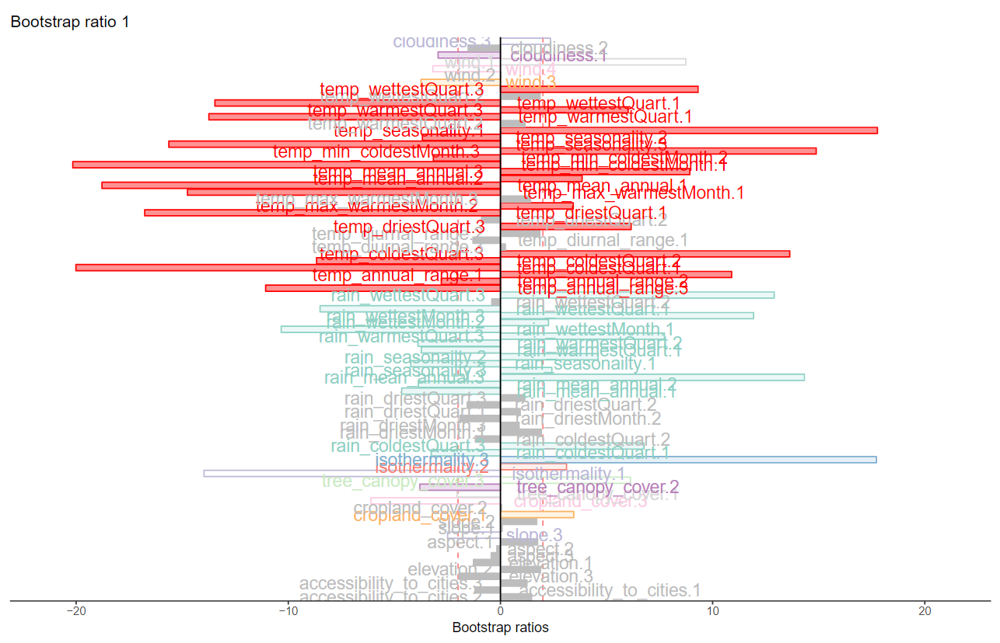

# Multi Variate Analysis

## Data set: Environmental Readings per Country

### ***Ritesh Malaiya***
*For the full version of cookbook, please visit [link](https://rkmalaiya.github.io/Environement_vs_Happiness/)*
# Overview

# Dataset
* Data: Measurements of environment conditions in Countries
* Rows: There are 137 observations, 1 for each country.
* Columns: Total 29 variables
    + Qualitative: Country (nominal), Happiness (Ordinal).
    + Quantitative: Aspect, Slope Crop Land, Tree Canopy Wind Cloud & Multiple variables for Temp & Rain
    

# Methods

## Quantitative

* PCA

## Qualitative

* MCA

* DiCA

## Grouping variables to observe relative effect among groups

* PLS-C

* MFA

* Cluster Analysis (DiSTATIS)

# Correlation Plot 

# Heat plot

# Quantitative Analysis
## PCA

| **Methods** | **Unhappy**               | **Normal**             | **Very Happy**                | **Reliability**  |
|------------------|-------------------------|-----------------------|---------------------------|------------|
| **PCA**     | Others                                      | Temp & Rain                         | N/A                     | Components have significant contribution but convex hull has overlapping areas and Component 2 & 7 contradicts |

# Qualitative Analysis
## Data Binning

## MCA

| **Methods** | **Unhappy**               | **Normal**             | **Very Happy**                | **Reliability**  |
|------------------|-------------------------|-----------------------|---------------------------|------------|
| **PCA**     | Others                                      | Temp & Rain                         | N/A                     | Components have significant contribution but convex hull has overlapping areas and Component 2 & 7 contradicts |
| **MCA**     | warm summers, cold winters, high rain | N/A     | Warm winter, cold summer, low rain    | Components have significant contribution but convex hull has overlapping areas                                 |

### MCA Inference

### Discriminant Correspondence Analysis (DiCA)

| **Methods** | **Unhappy**               | **Normal**             | **Very Happy**                | **Reliability**  |
|------------------|-------------------------|-----------------------|---------------------------|------------|
| **PCA**     | Others                                      | Temp & Rain                         | N/A                     | Components have significant contribution but convex hull has overlapping areas and Component 2 & 7 contradicts |
| **MCA**     | warm summers, cold winters, high rain | N/A     | Warm winter, cold summer, low rain    | Components have significant contribution but convex hull has overlapping areas                                 |
| **DiCA**    | warm summers, cold winters, high rain | Higher variation in temperature is correlated with lower happiness | Warm winter, cold summer, low rain, windy | Convex hulls are separeted but second component only has temp variables as significant                         |

### DiCA Inference

Grouping variables to observe relative effect among variables

## PLS-C

| **Methods** | **Unhappy**               | **Normal**             | **Very Happy**                | **Reliability**  |
|------------------|-------------------------|-----------------------|---------------------------|------------|
| **PCA**     | Others                                      | Temp & Rain                         | N/A                     | Components have significant contribution but convex hull has overlapping areas and Component 2 & 7 contradicts |
| **MCA**     | warm summers, cold winters, high rain | N/A     | Warm winter, cold summer, low rain    | Components have significant contribution but convex hull has overlapping areas                                 |
| **DiCA**    | warm summers, cold winters, high rain | Higher variation in temperature is correlated with lower happiness | Warm winter, cold summer, low rain, windy | Convex hulls are separeted but second component only has temp variables as significant                         |
| **PLS-C**   | Rain                                      | Temp                         | Temp                                      | Second component has more rain variables as significant than temp variables                                    |

## Multi Factor Analysis

| **Methods** | **Unhappy**               | **Normal**             | **Very Happy**                | **Reliability**  |
|------------------|-------------------------|-----------------------|---------------------------|------------|
| **PCA**     | Others                                      | Temp & Rain                         | N/A                     | Components have significant contribution but convex hull has overlapping areas and Component 2 & 7 contradicts |
| **MCA**     | warm summers, cold winters, high rain | N/A     | Warm winter, cold summer, low rain    | Components have significant contribution but convex hull has overlapping areas                                 |
| **DiCA**    | warm summers, cold winters, high rain | Higher variation in temperature is correlated with lower happiness | Warm winter, cold summer, low rain, windy | Convex hulls are separeted but second component only has temp variables as significant                         |
| **PLS-C**   | Rain                                      | Temp                         | Temp                                      | Second component has more rain variables as significant than temp variables                                    |
| **MFA**     |  Partial factors dominated by Temp, then rain and other variables   | Neither of partial factors seems to have sufficient effect       |  Partial factors dominated by Temp and other variables, lesser effect of rain         | Convex hull has overlapping areas                                                                              |

## Cluster Analysis - DiSTATIS

### Kmeans

# Conclusion

* **MCA** and **DiCA** agrees: 
  - Warmer winter, colder summer, low rain, windy cities makes people *happy*
  - Colder Winter, warmer summers, high rain, less windy makes people *unhappy*

However, even though **MCA** shows that most the variables has high contribution for the strongest signal in the data - **DiCA** shows that temp, rain and wind variables contributes significantly.

*Hence*, 

* Happiness doesn’t seem to be highly correlated to environmental conditions
* Temperature, rain and wind seem to be slightly correlated with happiness.
* Cluster Analysis doesn’t seem to show any patterns in the data.
