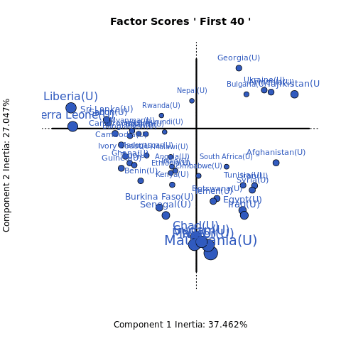
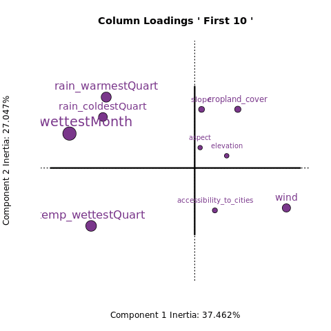

```{r}
# Installing required packages


```


# Introduction

## Data

### Read the data csv

```{r}
country_env_df = read.csv('dataset/World_countries_env_vars.csv')
```

### Explore the Data

```{r}
str(country_env_df)
```

```{r}
summary(country_env_df)
```


Domain of Data represented with type of measurement:

Qualitative
Happiness -> Ordinal

Quantitative Variables
Aspect -> Interval
Temp -> Interval
Wind -> Interval
Cloud -> Interval

Accessibility -> Ratio
Elevation -> Ratio
Slope -> Ratio
Cropland -> Ratio
Tree Canopy -> Ratio
Rain -> Ratio


## Subseting Data by Domain

There are multiple variables representing rain and Temp, for analysis purposes, lets choose annual mean for Rain and Temp.

```{r}
country_env_lessvars_df = country_env_df[,c('Country',
                                            'Happiness_Rank', 
                                          'accessibility_to_cities',
                                          'elevation',
                                          'aspect',
                                          'slope',
                                          'cropland_cover',
                                          'tree_canopy_cover',
                                          'isothermality',
                                          'rain_mean_annual',
                                          'temp_mean_annual',
                                          'wind',
                                          'cloudiness')]
country_env_df_for_pca = country_env_df[, !names(country_env_df) %in% c('Country')]
country_env_df_for_corr = country_env_lessvars_df[, !names(country_env_lessvars_df) %in% c('Country')]
rownames(country_env_df_for_corr) <- country_env_lessvars_df[,'Country']
rownames(country_env_df_for_pca) <- country_env_lessvars_df[,'Country']

head(country_env_df_for_corr, n = 6)
```


## Research Question:


```{r}
library(corrplot)

corr_result = cor(country_env_df_for_corr)
corrplot(corr_result)
```


```{r}
library(ExPosition)
country_env_pca <- epPCA(DATA = country_env_df_for_pca, center = TRUE, scale = TRUE, DESIGN = country_env_df$Country, graphs = FALSE)

```


## Scree Plot

```{r}
country_env_scree <- plot(country_env_pca$ExPosition.Data$eigs, ylab = "Eigen values",
                       xlab = "Components",
                       type = "l",
                       main = "SCREE Plot",)
points(country_env_pca$ExPosition.Data$eigs, cex = 2, pch = 19, col = "darkorchid4")
points(country_env_pca$ExPosition.Data$eigs, cex = 2, pch = 21, col = "black")
```


## Factor Scores

Since there are 137 observations / Countries, hence let's pick top 50 contributing countries. 


```{r}
groups_of_data <- vector('list', 7)

j = 1
below_20_order <- order(country_env_pca$ExPosition.Data$ci[, 1] + country_env_pca$ExPosition.Data$ci[, 2])

for (i in seq(0, 110, 20)) {
  
  curr <- below_20_order[1:(i+20)]
  
 groups_of_data[[j]] <- list(curr)
 j <- j + 1
 
}
 groups_of_data[[j]] <- list(below_20_order)

 names(groups_of_data) <- list_name
 
#for (l in groups_of_data) {
#  print(l)
#}
  
```


```{r message=FALSE, warning=FALSE}
library(animation)

list_name <- c('First 20', 'Next 20', 'Next 20', 'Next 20', 'Next 20', 'Next 20', 'All')
i = 1
saveGIF(expr = {
for (l in groups_of_data) {
  title = list_name[i]
  i = i + 1
 prettyPlot(data_matrix = country_env_pca$ExPosition.Data$fi[unlist(l),],  
                              dev.new=FALSE,
                              main = paste("Country Row Factor Scores '", title, "'"),
                              x_axis = 1, y_axis = 2, 
                              contributionCircles = TRUE, contributions = country_env_pca$ExPosition.Data$ci[unlist(l),], 
                              display_points = TRUE, pch = 21, cex = 1.2, 
                              col = country_env_pca$Plotting.Data$fi.col[unlist(l),], 
                              display_names = TRUE, 
                              xlab = paste0("Component 1 Inertia: ", round(country_env_pca$ExPosition.Data$t[1],3), "%"),
                              ylab = paste0("Component 2 Inertia: ", round(country_env_pca$ExPosition.Data$t[2],3), "%")
                              )
  }
}, movie.name = 'score.gif', interval = 2, clean = TRUE)
```



## Loadings

```{r}

groups_of_data <- vector('list', 6)

j = 1
below_20_order <- order(country_env_pca$ExPosition.Data$fj[, 1] + country_env_pca$ExPosition.Data$fj[, 2])

for (i in seq(0, 20, 5)) {
  
 curr <- below_20_order [1:(i+5)]
  
 groups_of_data[[j]] <- list(curr)
 j <- j + 1
 
}

groups_of_data[[j]] <- list(below_20_order)

#for (l in groups_of_data) {
#  print(l)
#}
```

```{r}
list_name <- c('First 20', 'Next 20', 'Next 20', 'Next 20', 'Next 20', 'All')

i = 1
saveGIF(expr = {
for (l in groups_of_data) {
  title = list_name[i]
  i = i + 1
  print(title)
                      prettyPlot(data_matrix = country_env_pca$ExPosition.Data$fj[unlist(l),],  
                            dev.new=FALSE,
                            main = paste("Country Environemnt Column Loadings '", title, "'"),
                            x_axis = 1, y_axis = 2, 
                            contributionCircles = TRUE, contributions = country_env_pca$ExPosition.Data$cj[unlist(l),], 
                            display_points = TRUE, pch = 21, cex = 1.2, 
                            col = country_env_pca$Plotting.Data$fj.col[unlist(l),], 
                            display_names = TRUE, 
                            xlab = paste0("Component 1 Inertia: ", round(country_env_pca$ExPosition.Data$t[1],3), "%"),
                            ylab = paste0("Component 2 Inertia: ", round(country_env_pca$ExPosition.Data$t[2],3), "%")
                            )
}
}, movie.name = 'loadings.gif', interval = 1, clean = TRUE)
```




