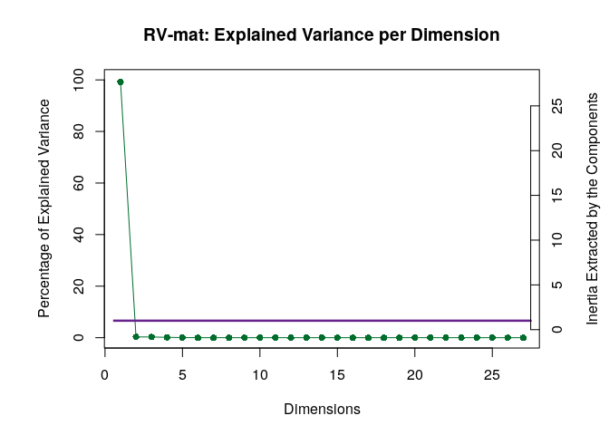
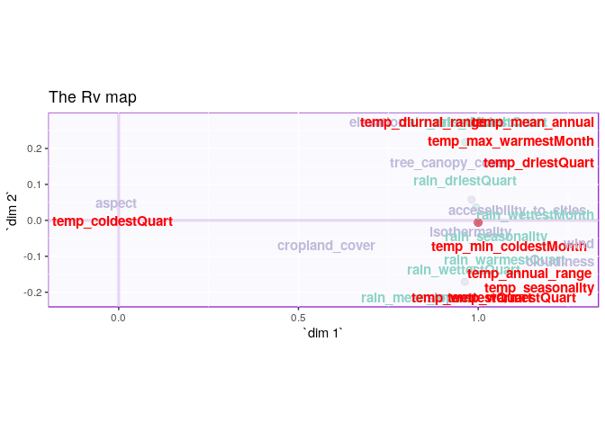
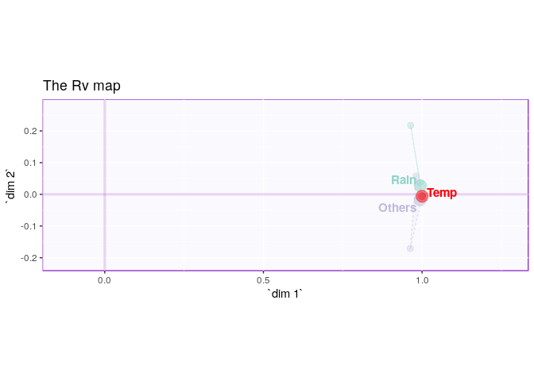
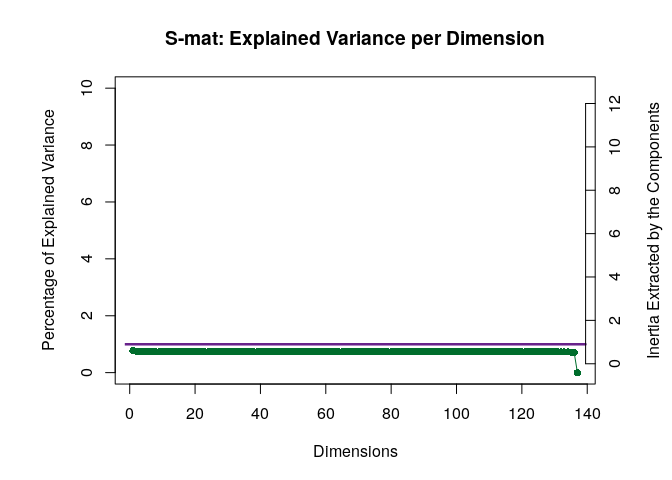
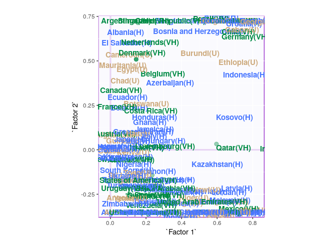
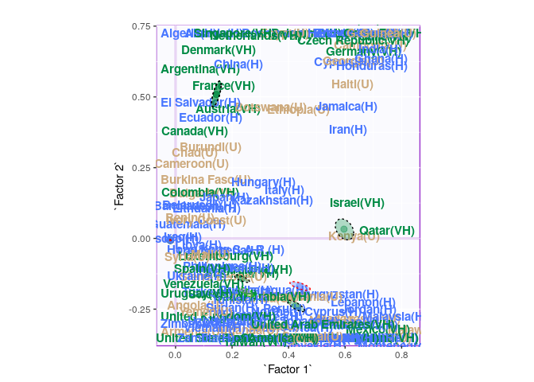
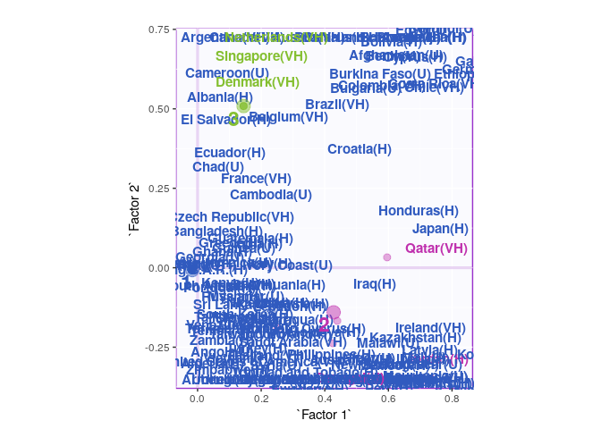
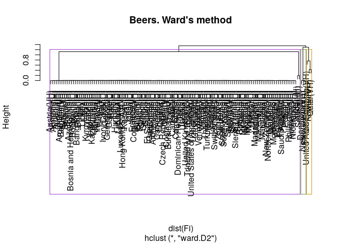
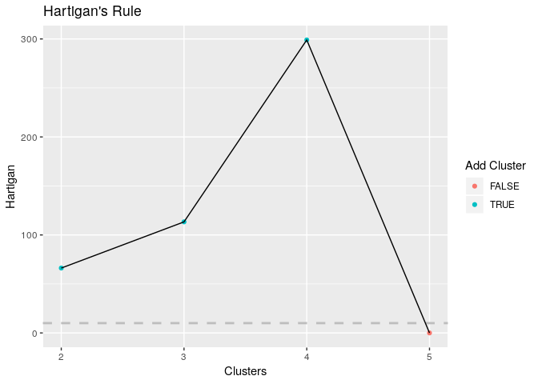

Ritesh\_Malaiya\_Group\_1\_DiSTATIS
================

    ## Skipping install of 'PTCA4CATA' from a github remote, the SHA1 (0a982b85) has not changed since last install.
    ##   Use `force = TRUE` to force installation

# DiSTATIS

## Description

DISTATIS is a new method that can be used to compare algorithms when
their outputs consist of distance matrices computed on the same set of
objects. The method first evaluates the similarity between algorithms
using a coefficient called the RV coefficient. From this analysis, a
compromise matrix is computed which represents the best aggregate of the
original matrices. In order to evaluate the differences between
algorithms, the original distance matrices are then projected onto the
compromise. The goal of DISTATIS is to analyze a set of distance
matrices. In order to compare distance matrices, DISTATIS combines them
into a common structure called a compromise and then projects the
original distance matrices onto this
compromise.

## Dataset - Pianists for Composers

|                | accessibility\_to\_cities | elevation |   aspect |     slope | cropland\_cover | tree\_canopy\_cover | isothermality | rain\_coldestQuart | rain\_driestMonth | rain\_driestQuart |
| -------------- | ------------------------: | --------: | -------: | --------: | --------------: | ------------------: | ------------: | -----------------: | ----------------: | ----------------: |
| Afghanistan(U) |                 317.71575 | 1831.7444 | 201.4298 | 1.5156001 |        9.511846 |           0.3746726 |      35.90442 |         128.718360 |         1.7224832 |          8.300540 |
| Albania(H)     |                  73.83086 |  651.8155 | 192.1303 | 1.8900753 |       23.346087 |          12.8046289 |      33.16941 |         392.508789 |        40.0884801 |        138.154620 |
| Algeria(H)     |                1212.79982 |  556.7583 | 184.9747 | 0.1708615 |        3.690864 |           0.1766562 |      40.29895 |          25.290778 |         0.9349921 |          6.088662 |
| Angola(U)      |                 378.20239 | 1061.4790 | 174.2569 | 0.1926286 |        2.794477 |          19.8701092 |      64.33239 |           8.054832 |         0.2601221 |          4.430197 |
| Argentina(VH)  |                 209.21958 |  682.7993 | 145.0314 | 0.6238553 |       21.962504 |           8.8336096 |      49.85147 |          79.087676 |        17.1832114 |         60.486305 |
| Armenia(U)     |                  97.29452 | 1850.4830 | 183.5375 | 2.3188956 |       21.338266 |           6.9929146 |      32.42359 |          69.674299 |        20.0054896 |         67.223098 |

4 Pianist for each of 3 Composers

    ## [1] Bootstrap On Factor Scores. Iterations #: 
    ## [2] 1000

## SCREE Plot - RV-MAT

<!-- -->

## Plotting Assessor Matrix

<!-- -->

### ConvexHull

<!-- -->

## SCREE Plot - SV-MAT

<!-- -->

## I Set

<!-- -->

    ## Warning: Removed 3 rows containing missing values (geom_text_repel).

<!-- -->

## Cluster Analysis (K-Means)

<!-- -->

## Cluster Analysis (hclust)

<!-- -->

## Cluster Analysis (Hartigan’s Rule)

    ##   Clusters  Hartigan AddCluster
    ## 1        2  66.20137       TRUE
    ## 2        3 113.33226       TRUE
    ## 3        4 298.98109       TRUE
    ## 4        5   0.00000      FALSE

<!-- -->
